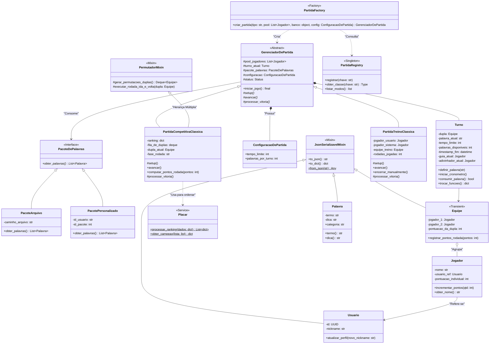

# Trocadu

Trocadu é um Party Game desenvolvido como uma API RESTful, baseando-se no paradígma da Programação Orientada a Objetos (POO).


## Instalação

Faça clone do projeto:
```bash
git clone https://github.com/SebastiaoSoares/Trocadu.git
```

Crie e entre em um ambiente virtual:
```bash
python -m venv venv

source ./venv/bin/activate # linux
.\venv\Scripts\Activate.ps1 # windows
```

Instale as dependências e execute o programa principal:
```bash
pip install -r requirements.txt
python run.py
```


## Diagrama de Classes




## Definição da Estrutura de Pastas

```
Trocadu/
├── docs/                               # Documentação e artefatos de planeamento
│   ├── prototype/                      # Imagens com as telas do jogo desenhadas (Wireframes)
│   │   ├── Configurações.png
│   │   ├── Home.png
│   │   ├── Inicio.png
│   │   └── Seleção-Jogo.png
│   ├── proposta_final.pdf              # Especificação e modelagem entregue
│   └── proposta_inicial.pdf
│
├── src/                                # Código-fonte principal da aplicação
│   ├── data/                           # Arquivos estáticos de dados
│   │   └── palavras.json               # Pacote padrão de palavras
│   │
│   ├── domain/                         # CAMADA DE REGRAS DE NEGÓCIO (Core/POO)
│   │   ├── entities/                   # Entidades independentes (Objetos do jogo)
│   │   │   ├── configuracao.py
│   │   │   ├── equipe.py
│   │   │   ├── jogador.py
│   │   │   ├── palavra.py
│   │   │   ├── placar.py
│   │   │   ├── turno.py
│   │   │   └── usuario.py
│   │   ├── interfaces/                 # Abstrações e Contratos (Princípio DIP do SOLID)
│   │   │   ├── partida_base.py         # Classe abstrata e Template Method
│   │   │   └── repositorio_palavras.py # Interface/Strategy para buscar palavras
│   │   ├── registry/                   # Padrão Registry
│   │   │   └── partida_registry.py     # Decorator para injetar modos de jogo
│   │   ├── shared/                     # Utilitários partilhados do domínio
│   │   │   ├── factories.py            # Padrão Factory Method
│   │   │   └── mixins.py               # Lógica de Permutação e Herança Múltipla
│   │   └── use_cases/                  # Casos de Uso (Modos de Jogo Concretos)
│   │       ├── __init__.py
│   │       ├── partida_competitiva_classica.py
│   │       └── partida_treino_classica.py
│   │
│   ├── infrastructure/                 # CAMADA DE DETALHES (DB, API, Frameworks)
│   │   ├── api/                        # Entrega Web (FastAPI)
│   │   │   ├── app.py                  # Instância principal e documentação Swagger
│   │   │   └── v1/
│   │   │       ├── endpoints/          # Controladores das rotas (Controllers)
│   │   │       │   ├── game/           # Rotas gerenciais do sistema
│   │   │       │   │   ├── auth.py
│   │   │       │   │   ├── general.py
│   │   │       │   │   ├── historico.py
│   │   │       │   │   ├── jogador.py
│   │   │       │   │   └── pacote.py
│   │   │       │   ├── partida/        # Ações específicas interagindo com Casos de Uso
│   │   │       │   │   ├── classica_competitiva.py
│   │   │       │   │   └── classica_treino.py
│   │   │       │   ├── game_routes.py
│   │   │       │   └── partida_routes.py
│   │   │       ├── routes.py           # Agregador mestre de rotas da versão 1
│   │   │       └── schemas/            # Pydantic Models (Validação de Input/Output)
│   │   │           ├── historico.py
│   │   │           ├── jogador_salvo.py
│   │   │           ├── pacote.py
│   │   │           └── partidas/
│   │   │               ├── classica_competitiva.py
│   │   │               └── classica_treino.py
│   │   ├── database/                   # Persistência com SQLAlchemy
│   │   │   ├── database.py             # Configuração do SQLite
│   │   │   └── models.py               # Mapeamento Relacional (ORM)
│   │   ├── repositories/               # Implementações dos Contratos (Repository Pattern)
│   │   │   ├── pacote_arquivo.py       # Lê do palavras.json
│   │   │   ├── pacote_personalizado.py # Lê do banco de dados (SQLite)
│   │   │   └── partida_repository.py   # Salva histórico
│   │   └── security/                   # Camada de Proteção
│   │       └── auth.py                 # Lógica de JWT e Hashing de senhas
│   │
├── tests/                              # Suite de testes automatizados (Pytest)
│   ├── test_entities.py
│   ├── test_factories.py
│   ├── test_mixins.py
│   ├── test_registry.py
│   └── test_use_cases.py               # Testes com Mocks (Cumpre requisito POO)
│
├── .env.example                        # Exemplo de variáveis de ambiente
├── .gitignore                          # Exclusões do Git
├── README.md                           # Documentação e instruções de execução
├── requirements.txt                    # Dependências do Python (FastAPI, SQLAlchemy, etc)
└── run.py                              # Ponto de entrada para iniciar o servidor Uvicorn
```
