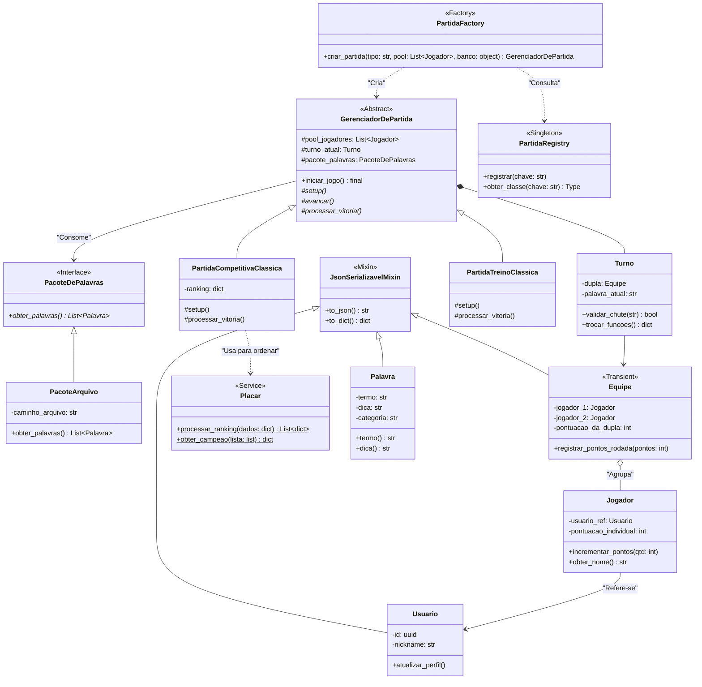

# Trocadu

Trocadu é um Party Game desenvolvido como uma API RESTful, baseando-se no paradígma da Programação Orientada a Objetos (POO).


## Instalação

Faça clone do projeto:
```bash
git clone https://github.com/SebastiaoSoares/Trocadu.git
```


## Diagrama de Classes




## Definição da Estrutura de Pastas

```
Trocadu/
├── src/
│   ├── domain/                             
│   │   ├── __init__.py
│   │   │
│   │   ├── entities/                       # Entidades (SRP)
│   │   │   ├── __init__.py
│   │   │   ├── jogador.py
│   │   │   ├── equipe.py
│   │   │   ├── turno.py
│   │   │   ├── placar.py
│   │   │   └── palavra.py
│   │   │
│   │   ├── interfaces/                     # Contratos (DIP)
│   │   │   ├── __init__.py
│   │   │   ├── partida_base.py             # Classe Abstrata (Template Method)
│   │   │   └── repositorio_palavras.py     # Interface para fontes de dados
│   │   │
│   │   ├── use_cases/                      # Regras de Negócio
│   │   │   ├── __init__.py
│   │   │   ├── partida_competitiva_classica.py
│   │   │   └── partida_treino_classica.py
│   │   │
│   │   ├── registry/                       # Registro Dinâmico de Modos
│   │   │   ├── __init__.py
│   │   │   └── partida_registry.py         # Decorator para registrar jogos
│   │   │
│   │   └── shared/                         # Utilitários
│   │       ├── __init__.py
│   │       ├── mixins.py                   # Serialização e Permutação
│   │       └── factories.py                # Factory Method
│   │
│   ├── infrastructure/
│   │   ├── __init__.py
│   │   ├── repositories/                   # Arquivos/Banco
│   │   │   └── pacote_arquivo.py
│   │   └── api/                            
│   │       └── routes.py                   # Endpoints da API
│   │
│   └── main.py
│
├── data/                                   # Arquivos JSON
├── tests/                                  # Testes Automatizados (Pytest)
├── docs/                                   # Documentação
└── requirements.txt
```
